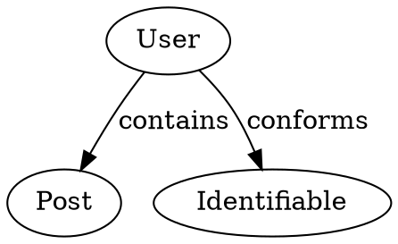

# Swift Diagram Tool

A powerful Swift package that analyzes Swift codebases and generates interactive visualizations of type relationships and dependencies. Perfect for understanding complex codebases, documenting architecture, and exploring Swift project structures.

## Features

- 🔍 **Swift Code Analysis** - Parse Swift files and extract type information, relationships, and dependencies
- 📊 **Multiple Output Formats** - Generate JSON, DOT (GraphViz), and interactive HTML visualizations  
- 🌐 **Interactive Web Viewer** - Beautiful web-based graph visualization using Cytoscape.js
- 🎯 **Relationship Mapping** - Track inheritance, protocol conformance, composition, and usage relationships
- 📱 **iOS/macOS Ready** - Designed for Apple platform development analysis
- ⚡ **Fast Processing** - Efficient parsing using SwiftSyntax

## Quick Start

### Installation

Clone the repository:
```bash
git clone https://github.com/yourusername/swift-diagram-tool.git
cd swift-diagram-tool
```

Build the tool:
```bash
swift build -c release
```

### Basic Usage

Analyze a Swift project and generate an interactive visualization:

```bash
# Analyze the Example directory and generate JSON output
.build/release/SwiftDiagramTool analyze Example --output analysis.json

# Generate HTML visualization
.build/release/SwiftDiagramTool generate --input analysis.json --format html --output diagram.html
```

### Web Viewer

For the best visualization experience, use the interactive web viewer:

1. Generate JSON analysis data
2. Start a local web server:
   ```bash
   python3 -m http.server 8000
   # or use Node.js: npx http-server .
   ```
3. Open `http://localhost:8000/Web/svg_graph_viewer.html`
4. The viewer will load your analysis data automatically

## Examples

### Analyzing a Simple Project

```bash
# Analyze the included example project
.build/release/SwiftDiagramTool analyze Example
```

This will analyze Swift files and show relationships like:
- `User` conforms to `Identifiable`, `Timestampable`
- `Post` contains `User` (author), `[Comment]` (comments), `[Tag]` (tags)
- `Comment` references `User` (author) and `Post` (parent)

### Interactive Web Visualization

The web viewer provides:
- **Node Navigation** - Click nodes to expand their relationships
- **Search** - Find specific types quickly
- **Detailed Info Panel** - View properties, methods, and protocols
- **Relationship Filtering** - Focus on specific relationship types
- **Zoom & Pan** - Navigate large graphs easily

### Output Formats

#### JSON Output
Structured data perfect for further processing:
```json
{
  "nodes": [
    {
      "type": {
        "name": "User",
        "kind": "class",
        "properties": [...],
        "methods": [...],
        "conformedProtocols": ["Identifiable"]
      },
      "relationships": [
        {"from": "User", "to": "Post", "kind": "contains"}
      ]
    }
  ]
}
```

#### DOT Output  
GraphViz format for custom visualizations:


## Advanced Usage

### Command Line Options

```bash
# Analyze with specific depth
.build/release/SwiftDiagramTool analyze MyProject --depth 3

# Filter by access level
.build/release/SwiftDiagramTool analyze MyProject --access-level public

# Include/exclude relationship types
.build/release/SwiftDiagramTool analyze MyProject --relationships inheritance,conformance
```

### Programmatic Usage

```swift
import SwiftDiagramTool

let analyzer = SwiftAnalyzer()
let results = try analyzer.analyzeDirectory("path/to/swift/project")
let generator = HTMLGenerator()
try generator.generate(from: results, outputPath: "output.html")
```

## Project Structure

```
SwiftDiagramTool/
├── Sources/
│   ├── SwiftDiagramTool.swift    # Main executable
│   ├── Analyzers/                # Swift syntax analysis
│   │   └── SwiftAnalyzer.swift
│   ├── Generators/               # Output format generators
│   │   ├── JSONGenerator.swift
│   │   ├── DOTGenerator.swift
│   │   └── HTMLGenerator.swift
│   ├── Models/                   # Data models
│   │   ├── TypeInfo.swift
│   │   └── RelationshipGraph.swift
│   └── main.swift               # CLI entry point
├── Web/                         # Interactive visualization
│   ├── svg_graph_viewer.html
│   ├── viewer.js
│   └── styles.css
├── Example/                     # Sample Swift files
└── TestProject/                # Sample project for testing
```

## Development

### Requirements

- Swift 6.0+
- macOS 13.0+ (for SwiftSyntax)
- Modern web browser (for visualization)

### Dependencies

- [SwiftSyntax](https://github.com/swiftlang/swift-syntax) - Swift source code parsing
- [ArgumentParser](https://github.com/apple/swift-argument-parser) - Command-line interface
- [Cytoscape.js](https://cytoscape.org/) - Web-based graph visualization

### Building from Source

```bash
# Debug build
swift build

# Release build  
swift build -c release

# Run tests
swift test

# Generate documentation
swift package generate-documentation
```

### Contributing

1. Fork the repository
2. Create a feature branch (`git checkout -b feature/amazing-feature`)
3. Commit your changes (`git commit -m 'Add amazing feature'`)
4. Push to the branch (`git push origin feature/amazing-feature`)
5. Open a Pull Request

## Use Cases

- **Architecture Documentation** - Visualize your app's structure
- **Code Review** - Understand complex relationships quickly
- **Refactoring** - Identify tightly coupled components
- **Onboarding** - Help new team members understand the codebase
- **Technical Debt** - Find problematic dependencies
- **API Design** - Visualize public interfaces

## Screenshots

### Interactive Graph View


### Detailed Type Information


## License

This project is licensed under the MIT License - see the [LICENSE](LICENSE) file for details.

## Acknowledgments

- Built with [SwiftSyntax](https://github.com/swiftlang/swift-syntax)
- Visualization powered by [Cytoscape.js](https://cytoscape.org/)
- Inspired by dependency analysis tools like [swift-package-graph](https://github.com/pointfreeco/swift-package-graph)

---

Made with ❤️ for the Swift community